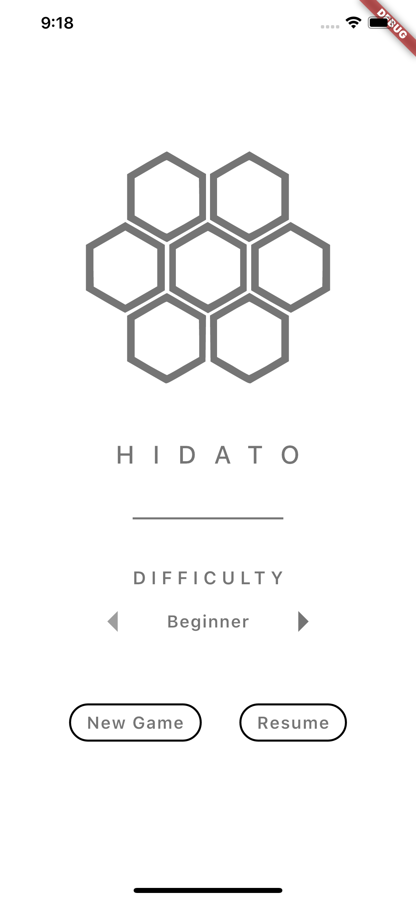

# Hidato

## About the App

This is the repository for the app implementing the game Hidato. The application has been developed using the Flutter SDK. The apps is compatible with both iOS and Android. 

## Screens

### Home Screen

### Puzzle Screen

## About the Game

Hidato also known as "Hidoku", is a logic puzzle game invented by Dr. Gyora M. Benedek, an Israeli mathematician. The goal of Hidato is to fill the grid with consecutive numbers that connect horizontally, vertically, or diagonally. The name Hidato is a registered trademark of Doo-Bee Toys and Games LTD, a company co-founded by Benebek himself.
